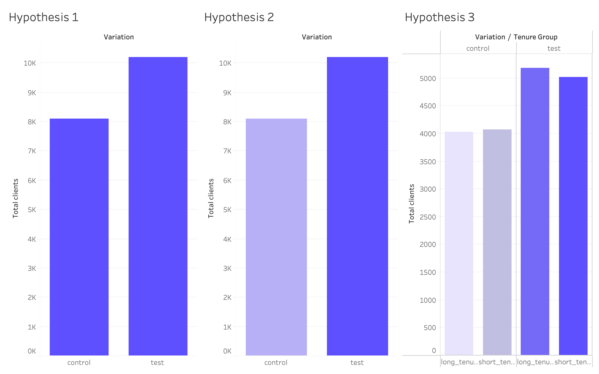
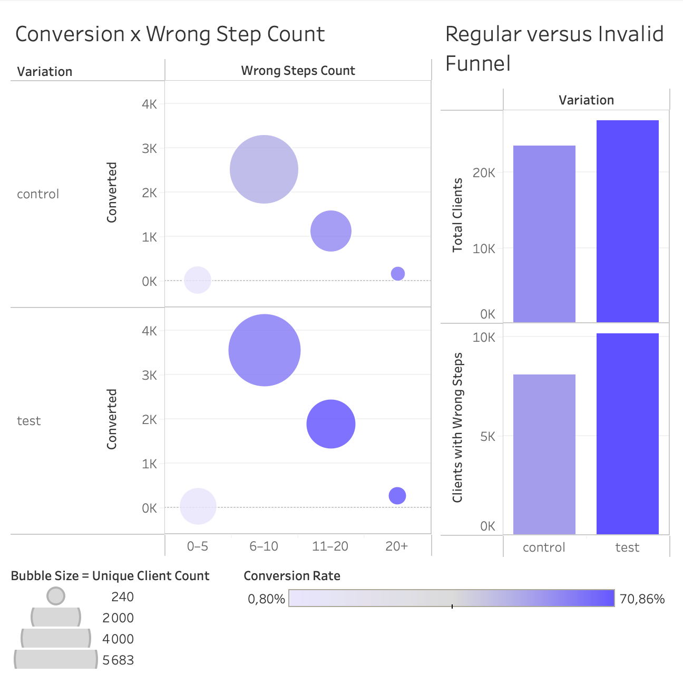

## 📉 Vanguard A/B Test Analysis 📈

<a href="https://prezi.com/view/LHHavwiSJLts2NLWv4dH/?referral_token=w0QQB7lnB3FN" style="color:#5CE1E6;" target="_blank">A/B Test Analysis Presentation</a>

--- 

## 🔸 Demographic Analysis

1. Did the Test variation significantly impact the conversion rate?
2. Does age influence the conversion difference between Test and Control?
3. Does the Test variant convert better (or worse) than the Control within the high-value customer segment?
4. Does the Test variant convert users faster than the Control?

## 🔹 Step Errors Analysis

1. Does the frequency of step errors differ between clients in the Control versus Test variants?
2. For users who follow an invalid step sequence, is there a significant difference in conversion between Test and Control?
3. Does client tenure impact conversion among clients with invalid step sequences?
4. How does conversion change with invalid step count across Control and Test variants?

## 📊 Dashboard

**Graphic representation**:

  
  

